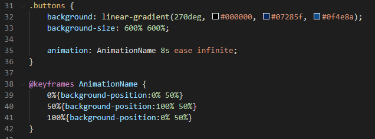
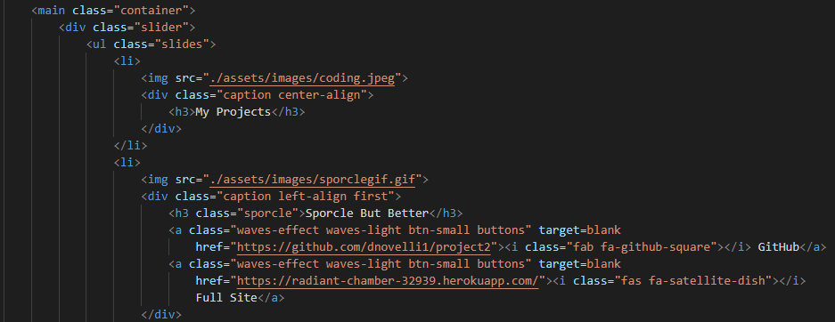

# Updated Coding Portfolio

It's time for another profile update! Over the last month I have begun to work with full stack applications. Diving right into the work with databases and creating the connection between front-end development and backend. I needed to update my portfolio with some of my new work. Unfortunately some of the assignments are done through the console, so I had to leave a few out. As soon as they are deployed I will be sure to enter them into the carousel. If you would like to view my portfolio, please click the link below:

[Portfolio](https://dnovelli1.github.io/jakesportfolio/)

## Table of Contents

* [Technology-Used](#technology-used)

* [Preview](#preview)

* [Making](#making)

* [Questions](#questions)

* [License](#license)

## Technology-Used

- GitHub - repository storage for the project in order to amke changes, deploy them and push to a main branch. 

- GitBash - used for written commands and communicating with the repository stored on GitHub.

- HTML - used to create and edit electronic documents stored on the web.

- CSS - used to edit style and appearance of the website.

- Materialize.css - component library used with the combination of CSS, HTML and Javascript all in one. Used to display consistency and cleanliness on a webpage. Including:
    - Carousel
    - Buttons
    - Event Listeners/Functions
    - NavBar/Mobile Menu

## Preview

## Making

How was it made? Take a look here!

## Questions

Please click the link to see my Full GitHub profile:

[GitHub](https://github.com/dnovelli1)

If you have any questions, please see the following links to best get in contact with me:

[Email Me](jakenovelli11@gmail.com)

## License

This project is currently licensed under the [MIT-License](LICENSE)
  
